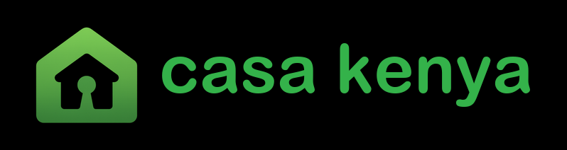

# Casa Congo

WhatsApp-first housing marketplace for the **Democratic Republic of the Congo** — its own codebase, database, WhatsApp number, and Railway project.

> Sibling projects: `../Casa Kenya`, `../Casa Rwanda`, `../Casa Nigeria`, `../Casa Cameroon`. Do not mix env secrets or databases.

See [Docs/CASA_CONGO_SETUP.md](Docs/CASA_CONGO_SETUP.md).

---

<p align="center">
  
</p>

<h1 align="center">Casa Congo — Logement sur WhatsApp</h1>

<p align="center">Trouvez un logement. Depuis n'importe quel téléphone. Dans n'importe quel quartier de la RDC.</p>

---

## Country defaults

| | Value |
|--|--|
| Currency | **CDF** |
| Phone | **+243** |
| WhatsApp | **+243 812 356 774** |
| Locations | **26 provinces** |
| Language | **French only** |
| Timezone | Africa/Kinshasa |
| Domain | casahomesdrcongo.com |
| Mobile | com.casahomesrdc.app · scheme `casacd` |
| Payments | Off until Airtel Money / Orange Money / M-Pesa RDC |

## Quick Start

Local Docker uses **different ports** than Casa Kenya so both can run at once (Postgres `5434`, Redis `6381`).

```bash
docker compose up -d
cp .env.example .env
cd backend && npm install && npm run db:migrate
npm test
npm run dev
```

## Deploy

Do **not** reuse the Kenya Railway project, WhatsApp number, or database. See [Docs/CASA_CONGO_SETUP.md](Docs/CASA_CONGO_SETUP.md).
